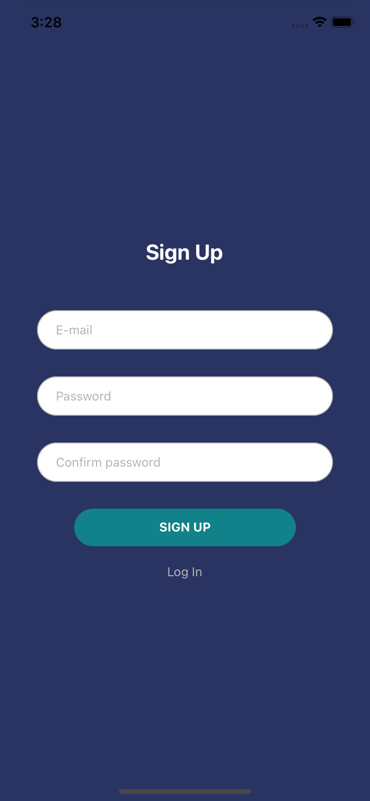
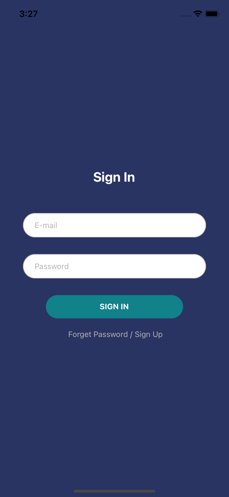
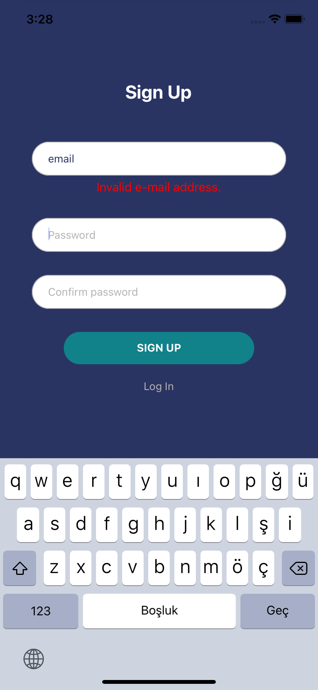
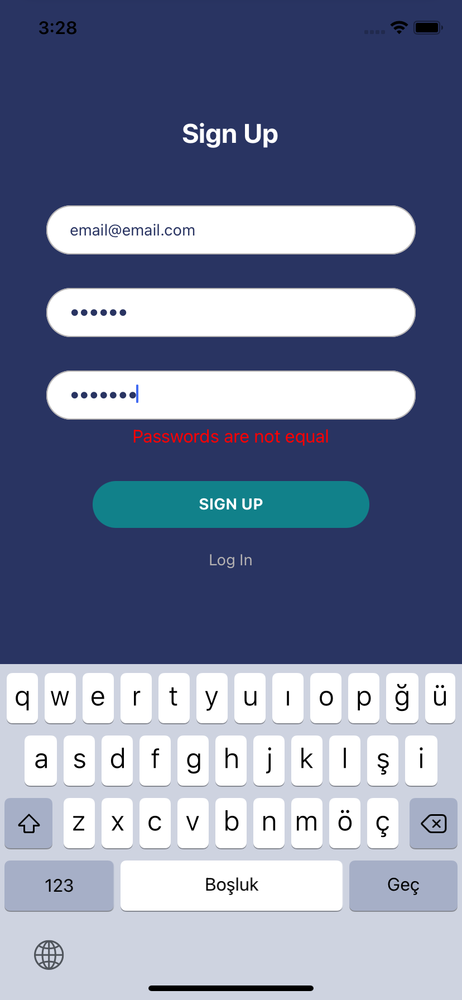
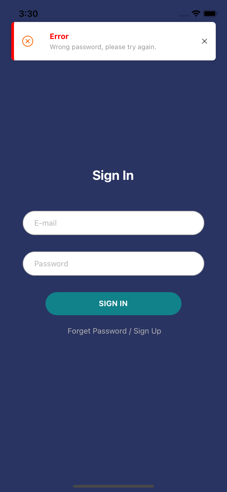
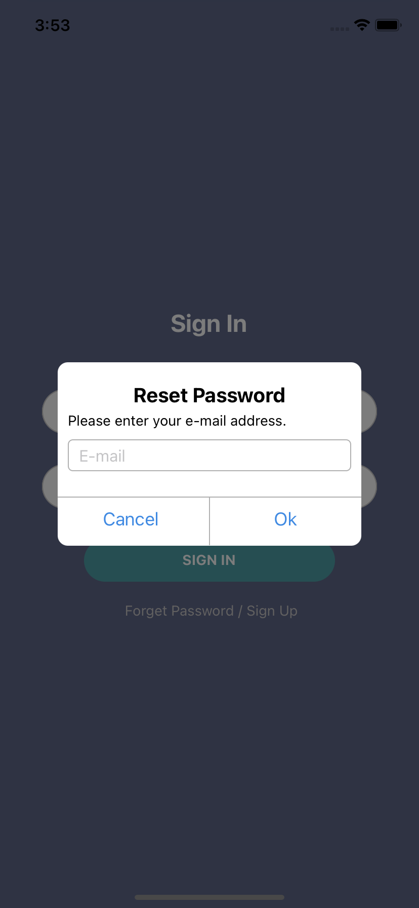
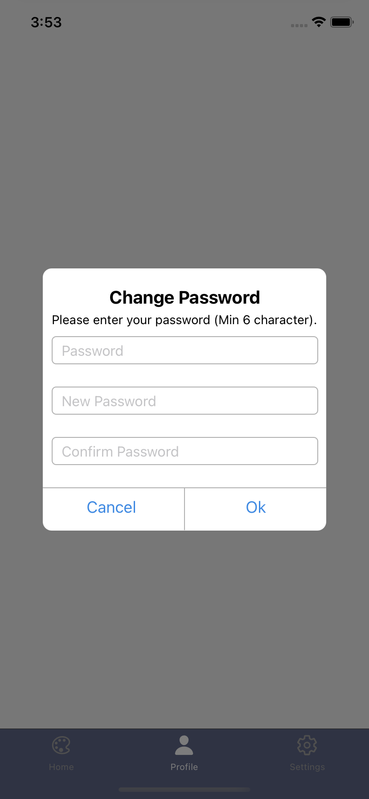
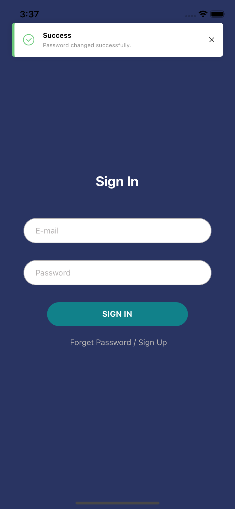
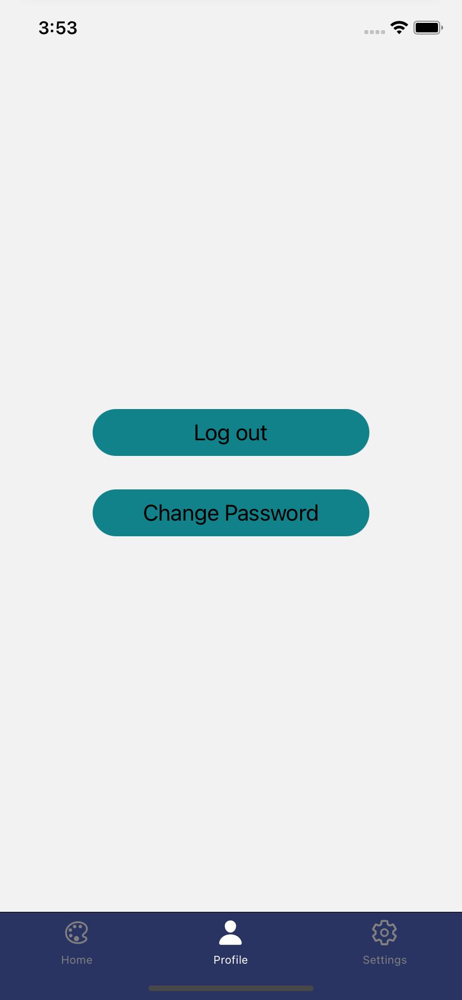

# React Native Login Screen Example

-  Firebase Email-Password Auth,
-  Redux for state management,
-  Change password,
-  Reset password,
-  Toast messages for error or success actions,
-  Validate E-mail and password
-  React Hook Form

  
  
  
  

  

  
  
  
  
  
  

## Installation

- 1- clone app
- 2- `npm install` in terminal project directory
- 3- Install and configure [@react-native-firebase](https://rnfirebase.io/#installation)
- 4- For IOS => go to /ios directory and run  => `npx pod-install`

Don't forget [Create a Firebase project](https://console.firebase.google.com) and configure config.js file in project.

## Usage Libraries

* [React Redux](https://github.com/reduxjs/react-redux)
* [Redux](https://github.com/reduxjs/redux)
* [redux-thunk](https://github.com/reduxjs/redux-thunk)
* [@react-native-firebase](https://rnfirebase.io/)
* [@react-navigation](https://reactnavigation.org/)
* [react-hook-form](https://react-hook-form.com/)
* [react-native-toast-message](https://github.com/calintamas/react-native-toast-message#readme)
* [react-native-vector-icons](https://github.com/oblador/react-native-vector-icons)
* [validate.js](https://validatejs.org/)

## Contribute

Contributions are always welcome!
